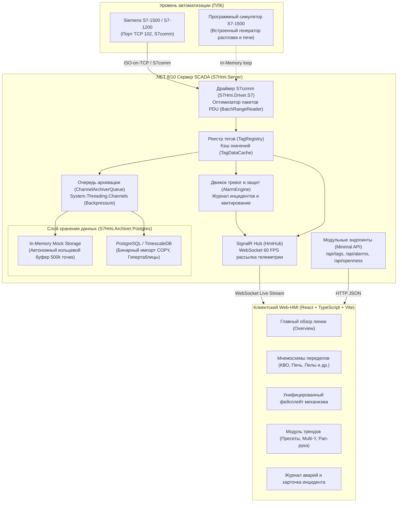
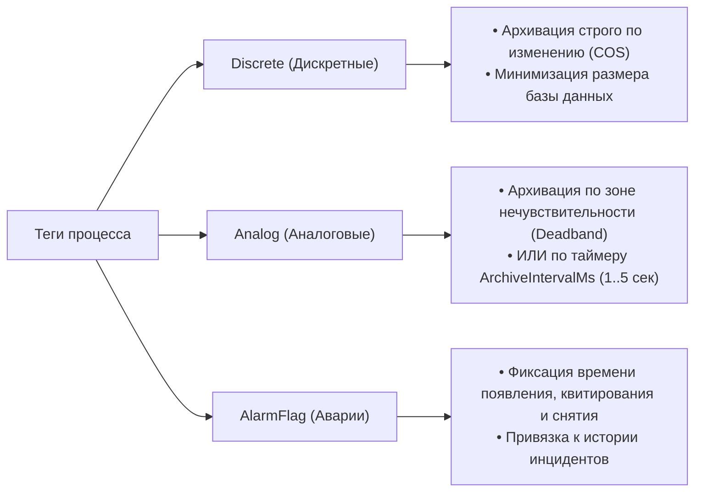
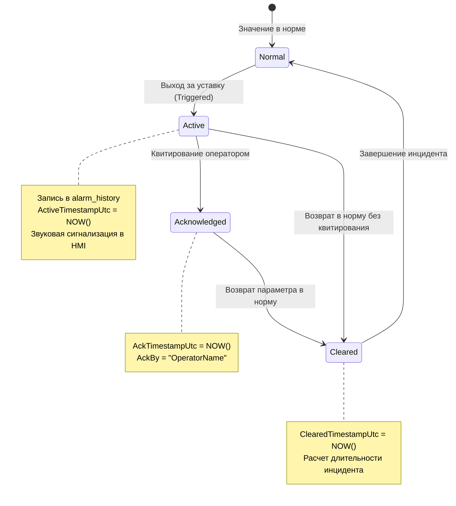

# Архитектура системы S7 Industrial HMI SCADA

Данный документ описывает системную архитектуру, потоки данных, протоколы взаимодействия и принципы построения промышленной SCADA/HMI-системы для непрерывной линии производства минеральной (базальтовой) ваты на базе контроллеров Siemens S7-1200 / S7-1500.

---

## 1. Обзор архитектуры

Система построена по многоуровневой модульной архитектуре (Clean Architecture / Hexagonal Architecture) с разделением ответственности между низкоуровневым обменом с ПЛК, ядром обработки сигналов, очередью архивации и клиентским Web-HMI интерфейсом.

---

## 2. Оптимизация сетевого обмена с ПЛК (S7comm Protocol)

В отличие от стандартного побайтового чтения тегов, в системе реализован алгоритм **PDU Packing / Batch Range Optimization** (`BatchRangeReader.cs`):

1. **Группировка по блокам данных (DB):** Все запрашиваемые теги группируются по номеру DB.
2. **Слияние близких диапазонов:** Теги, расположенные в памяти близко друг к другу (с зазором менее 32 байт), объединяются в единый непрерывный интервал чтения.
3. **Фрагментация по лимиту PDU:** Полученные диапазоны нарезаются на чанки, не превышающие максимальный размер полезной нагрузки S7comm PDU (обычно 240–480 байт).
4. **Результат:** Вместо 200–500 раздельных сетевых запросов опрос всей технологической линии выполняется всего за **3–6 сетевых пакетов**, обеспечивая стабильный цикл опроса **100–200 мс** при RTT < 2 мс.

---

## 3. Классификация тегов и гибридная модель архивации

Все переменные процесса разделены на 3 категории (`TagCategory`):

---

## 4. Жизненный цикл аварийного события (Alarms & Events)

Каждая аварийная уставка (`AlarmDefinition`) отслеживается конечным автоматом состояний:

---

## 5. Гибкая конфигурация базы данных (In-Memory Mock ⇄ PostgreSQL)

В `appsettings.json` поддерживается мгновенное переключение режима хранения:
- **`ArchiverMode: "InMemory"`** — автономная работа без PostgreSQL (кольцевой буфер на 10 000 точек/тег, генерация демо-трендов).
- **`ArchiverMode: "Postgres"`** — промышленное сохранение в PostgreSQL с гипертаблицами TimescaleDB через бинарный импорт `Npgsql.BeginBinaryImportAsync(COPY ...)`.
